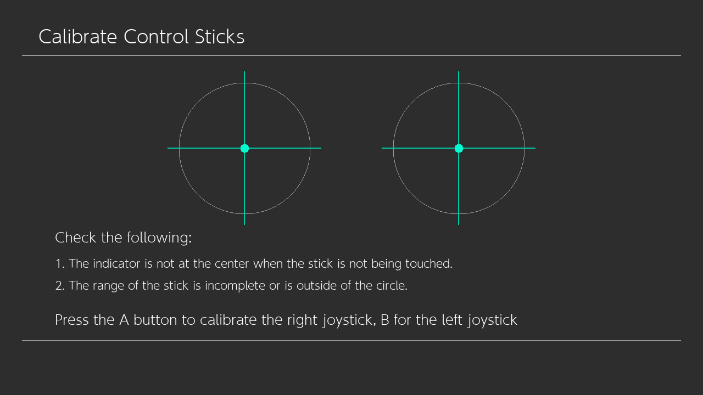
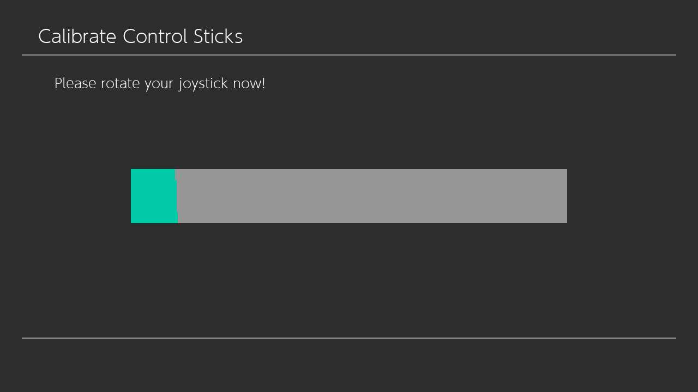
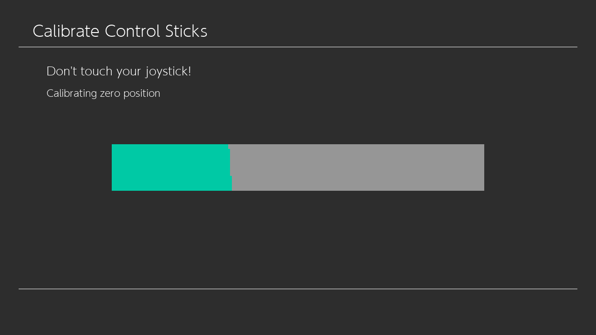
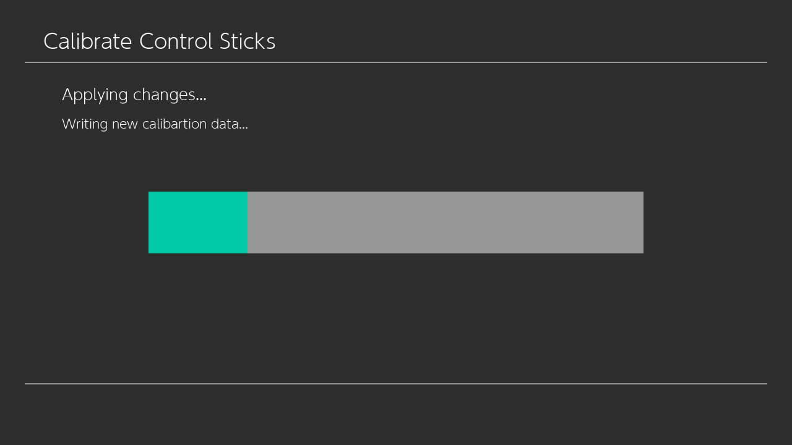

# Trimui Smart Pro Joystick Calibration

Small program to calibrate the joysticks for the TSP

Written in C and SDL2

## Installation

1. Download the [lastest release](https://github.com/Jpe230/Trimui_Smart_Pro-JoyCalibration/releases)
2. Extract the content of the zip folder into your `/userdata/roms/ports` folder, the structure needs to be as follow:

```
├─ userdata/roms/ports/
   ├─ TSP_Calibration/
      ├─ TSP_Calibration/
      │  ├─ font.ttf
      │  ├─ TSP_Calibration
      ├─ TSP_Calibration.sh
```
3. Update your gamelist
4. In the `Ports` section a new entry called `TSP_Calibration` should appear

## Usage

### Controls

* A Button: Select right joystick
* B Button: Select left joystick
* X Button: Close the program

### Start screen

In this screen you can test your joysticks and select which joystick to calibrate, the program will guide you in calibrating your sticks.



### Calibration screen

You need to rotate your joysticks for about 5-6 to capture its max. position.

>It's recommended to not apply to much pressure otherwise you will struggle in games that requires full range of motion.



In the next section the program will capture the rest/zero position of the joystick, it is important to not move the stick otherwise the joystick will be offcenter.



### Applying calibration

This program kills and restarts a daemon called `trimui-inputd` which is responsible to convert the raw values of the sticks to virtual controller inside Linux. It is recommended to perform a reboot after each calibration.



This program calls the utility `batocera-save-overlay` it could take a while, especially if you have several change in your filesystem or it is the first time your are using it.


## Compile

To compile you will need and aarch64 device or rootfs with the build essentials

>I personally use my [Sonic Pad rootfs creator](https://github.com/Jpe230/SonicPad-Debian/) for my dev enviroment (same SoC btw)

Additionally you will need to install the libraries for `SDL2` and `SDL2 TTF`

To compile:
```bash
make
```

The result will be located at `./build/TSP_Calibration`
